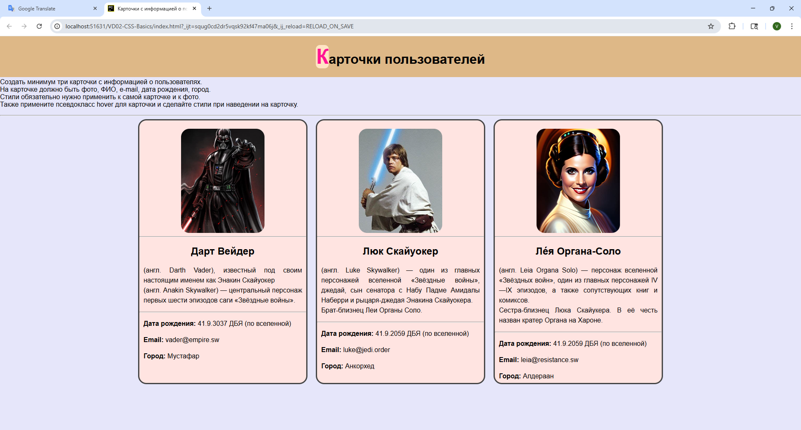

# Карточки пользователей

Учебный проект по HTML и CSS, в котором реализованы карточки с информацией о персонажах вселенной «Звёздные войны».  
Проект демонстрирует работу с версткой, стилями, позиционированием и эффектами при наведении.

---

## ✨ Функционал
- Отображение карточек с фото, именем, описанием и данными (дата рождения, e‑mail, город).
- Горизонтальное расположение карточек с помощью **Flexbox**.
- Единый размер фотографий с использованием `object-fit: cover`.
- Центрированный заголовок с фиксированным позиционированием.
- Эффекты при наведении (`hover`): увеличение карточки и фото.
- Аккуратные отступы и выравнивание текста по ширине.

---

## 🛠️ Технологии
- **HTML5** — структура страницы.
- **CSS3** — стилизация, Flexbox, псевдоклассы.
- Шрифты: системный `Arial, sans-serif`.
- Цветовая схема: фон страницы `lavender (#E6E6FA)`, карточки `#FFE4E1`, заголовок `burlywood`.

---

## 📂 Структура проекта
```text
project/ 
├── index.html # Основной HTML-файл 
├── style.css # Стили для карточек и страницы 
└── photo/ # Папка с изображениями персонажей
```

---

## 📸 Скриншот


---

## 🚀 Запуск
1. Клонируйте или скачайте проект.
2. Убедитесь, что в папке есть `index.html` и `style.css`.
3. Откройте файл `index.html` в браузере.
4. Готово — карточки пользователей будут отображаться локально.

---

## 📖 Примечания
- В проекте использованы персонажи «Звёздных войн» для учебных целей.
- Электронные адреса и даты рождения вымышленные, добавлены для демонстрации структуры карточки.
- Код оформлен так, чтобы быть готовым к портфолио.


